<!-- _class: cover -->
<!-- _paginate: false -->
<!-- _footer: "" -->

# PLIIIZ — Dossier Technique
## Demande de Licence Fintech BECEAO
### Infrastructure Backend & Architecture des Systèmes d'Information

**Version 2.0 — Mars 2026**
Document confidentiel — Réservé à l'usage exclusif de la BECEAO
Préparé par la Direction Technique PLIIIZ · technique@plizmoney.com

---

<!-- _paginate: false -->

# Sommaire

| # | Section |
|---|---------|
| 1 | Présentation de la plateforme |
| 2 | Architecture technique globale |
| 3 | Infrastructure Cloud AWS |
| 4 | Sécurité des Systèmes d'Information |
| 5 | Conformité KYC / LCB-FT |
| 6 | Gestion des Transactions & Flux Financiers |
| 7 | Système de Frais & Modèle Économique |
| 8 | Interopérabilité & Partenaires |
| 9 | Protection des Données Personnelles |
| 10 | Plan de Continuité d'Activité (PCA/PRA) |
| 11 | Monitoring, Audit & Traçabilité |
| 12 | Gouvernance & Contrôle Interne |
| 13 | Gestion des Risques Opérationnels |
| 14 | Pipeline DevSecOps & Qualité |
| 15 | Schémas d'Architecture |
| 16 | Conclusion & Engagements BECEAO |

---

<!-- _class: divider -->
<!-- _paginate: false -->

# 01
# Présentation de la Plateforme
## Vision · Services · Acteurs · Monnaie

---

# 1.1 Vision et Objet Social

**PLIIIZ** est une plateforme de paiement numérique de nouvelle génération opérant dans l'espace économique de l'**UEMOA**. Elle vise à démocratiser l'accès aux services financiers pour les populations bancarisées et non-bancarisées de la zone franc CFA, en proposant une solution de portefeuille électronique (e-wallet) multidimensionnelle.

**Unité monétaire :** Franc CFA — **XOF** · Conformité BECEAO intégrale

---

# 1.2 Périmètre des Services

| Service | Description | Statut |
|---------|-------------|--------|
| **Transfert P2P** | Envoi et réception entre utilisateurs enregistrés | Opérationnel |
| **Paiement marchand** | Paiement via QR code ou code marchand unique | Opérationnel |
| **Top-up portefeuille** | Rechargement via Wave, Orange Money, MTN | Opérationnel |
| **Gestion RIB** | Enregistrement et gestion des coordonnées bancaires | Opérationnel |
| **Paiement de factures** | Woyofal (SENELEC), Rapido, Airtime | Opérationnel |
| **Abonnement premium** | Exonération de frais pour clients fidèles | Opérationnel |
| **KYC niveau 2** | OCR document d'identité + liveness detection | En développement |
| **MTN / Ecobank** | Intégration Mobile Money + virement bancaire | En intégration |

---

# 1.3 Acteurs de l'Écosystème


---

<!-- _class: divider -->
<!-- _paginate: false -->

# 02
# Architecture Technique Globale
## Stack · Couches applicatives · Modèle de données

---

# 2.1 Stack Technologique

| Composant | Technologie | Justification |
|-----------|-------------|---------------|
| Framework principal | **Django 5.1.3** | Mature, éprouvé, OWASP-compliant |
| API REST | **Django REST Framework** | Standard industrie |
| Authentification | **SimpleJWT** | JWT RS256/HS256, rotation activée |
| Documentation API | **drf-yasg** (OpenAPI 3.0) | Swagger auto-généré |
| Clients HTTP asynchrones | **httpx** | Appels non-bloquants partenaires |
| Messaging temps réel | **paho-mqtt** | MQTT TLS — standard Fintech |
| OTP | **pyotp** (TOTP RFC 6238) | Standard IETF — auth forte |
| SMS / OTP | **Twilio SMPP** | Routage SMS international certifié |
| Base de données | **PostgreSQL 16** | ACID, performant, enterprise |
| Conteneurisation | **Docker + Compose** | Portabilité, reproductibilité |
| Reverse proxy | **Nginx** | Terminaison TLS, performance |
| Certificats SSL/TLS | **Let's Encrypt (ACME)** | Auto-renouvellement |

---

# 2.2 Architecture en Couches


---

# 2.3 Modèle de Données — Entités Clés

| Entité | Champs critiques | Rôle |
|--------|-----------------|------|
| `CustomUser` | uuid (indexé), user_type, is_subscribed | Identité unique |
| `Wallet` | phone_number UNIQUE, balance, currency=XOF | Portefeuille électronique |
| `Merchant` | merchant_code MCH-XXXXXXXX, business_name | Compte marchand |
| `RIB` | banque, bank_code, numero_compte, cle_rib | Coordonnées bancaires |
| `Transaction` | order_id, sender, receiver, amount, status, fee_applied | Opération financière |
| `WalletBalanceHistory` | balance_before, balance_after, timestamp | **Piste d'audit immuable** |
| `TariffGrid / Fee` | min/max_amount, percentage, fixed_amount | Grille tarifaire |
| `FeeDistribution` | actor_type, amount | Répartition des frais |
| `TransactionStatusCheck` | external_reference UNIQUE, status, last_checked | Déduplication webhooks |

> **Clé réglementaire :** `WalletBalanceHistory` est une table append-only qui permet de reconstituer l'historique exact de chaque portefeuille à tout instant, constituant la piste d'audit financière exigée par la BECEAO.

---

<!-- _class: divider -->
<!-- _paginate: false -->

# 03
# Infrastructure Cloud AWS
## Services · Haute Disponibilité · Scalabilité

---

# 3.1 Services AWS Déployés

| Service | Rôle | Configuration |
|---------|------|---------------|
| **VPC** | Réseau isolé, sous-réseaux privés/publics | Multi-AZ (3 zones de disponibilité) |
| **ECS Fargate** | Exécution des conteneurs Django | Auto Scaling Group |
| **ALB** | Répartition de charge HTTPS | WAF intégré, health checks |
| **RDS PostgreSQL 16** | Base de données principale | Multi-AZ, read replicas, AES-256 |
| **ElastiCache Redis** | Cache sessions + rate limiting | Cluster mode, chiffré |
| **S3** | Logs, backups, fichiers KYC | Versioning, MFA Delete, AES-256 |
| **AWS WAF + Shield** | Firewall applicatif + anti-DDoS | Règles OWASP Top 10 |
| **CloudWatch** | Monitoring, métriques, alertes | Dashboards + alertes SMS/email |
| **CloudTrail** | Audit de toutes les actions AWS | Immuable, chiffré, 7 ans de rétention |
| **AWS KMS** | Gestion des clés de chiffrement | Customer Managed Keys (CMK) |
| **Secrets Manager** | Clés API partenaires, mots de passe | Rotation automatique |
| **Route 53** | DNS avec failover automatique | Health checks intégrés |

---

# 3.2 Architecture Haute Disponibilité AWS


---

# 3.3 Scalabilité & SLA

| Métrique | Configuration actuelle | Cible auto-scaling |
|----------|----------------------|--------------------|
| Transactions/seconde | 50 TPS (rate limit actif) | **500+ TPS** |
| Instances applicatives | 2 minimum (HA garantie) | Auto-scale jusqu'à 20 |
| Connexions DB simultanées | 100 (connection pool) | 500 (RDS Proxy) |
| Latence API p95 | < 200 ms | < 300 ms sous charge max |
| **Disponibilité SLA** | **99,95 %** | ~4 h d'indisponibilité max/an |
| Failover base de données | < 2 min | RDS Multi-AZ automatique |
| Rétention des backups | 35 jours | Snapshots RDS automatiques |

> **Région principale :** `af-south-1` (Afrique du Sud) — Localisation définitive arrêtée conjointement avec la BECEAO pour respecter la souveraineté numérique UEMOA.

---

<!-- _class: divider -->
<!-- _paginate: false -->

# 04
# Sécurité des Systèmes d'Information
## Defense in Depth · Zero Trust · OWASP · Chiffrement

---

# 4.1 Flux d'Authentification


---

# 4.2 Chiffrement — Vue Complète

| Contexte | Algorithme | Implémentation |
|----------|-----------|----------------|
| Transport API | **TLS 1.3** | AWS ACM + Nginx |
| Transport MQTT | **TLS 1.2+** port 8883 | HiveMQ Cloud |
| Données au repos — DB | **AES-256** | AWS RDS Encryption |
| Données au repos — S3 | **AES-256** | SSE-KMS |
| Clés API partenaires | **AES-256** | AWS Secrets Manager |
| Mots de passe utilisateurs | **PBKDF2-SHA256** | Django auth system |
| Signature webhooks | **HMAC-SHA256** | Vérification Djamo |
| Gestion des clés maîtres | **CMK** | AWS KMS Customer Managed Keys |

---

# 4.3 Conformité OWASP Top 10

| Vulnérabilité | Mesure implémentée |
|---------------|--------------------|
| A01 — Broken Access Control | Permissions DRF par rôle (user/merchant), `IsAuthenticated` |
| A02 — Cryptographic Failures | TLS obligatoire, AES-256, PBKDF2 mots de passe |
| A03 — Injection SQL | ORM Django — requêtes paramétrées, jamais de SQL brut |
| A04 — Insecure Design | Architecture en couches, séparation des responsabilités |
| A05 — Security Misconfiguration | `DEBUG=False` en prod, headers sécurité Nginx, HSTS |
| A06 — Vulnerable Components | pip-audit, Snyk, mises à jour régulières |
| A07 — Identification Failures | JWT rotatif, rate limiting auth 10/min, blacklist tokens |
| A09 — Security Logging | Logs complets : transactions, auth, erreurs → CloudWatch |
| A10 — SSRF / Request Forgery | CSRF tokens, CORS whitelist stricte (plizmoney.com) |

---

# 4.4 Rate Limiting & Gestion des Secrets

### Politique de Rate Limiting

| Contexte | Limite | Protection |
|----------|--------|------------|
| API anonyme | 100 req/heure | Scraping, abus |
| API authentifiée | 1 000 req/heure | Surcharge |
| Endpoints d'authentification | **10 req/minute** | Brute force PIN |
| Endpoints transactions | **50 req/minute** | Fraude automatisée |
| AWS WAF | Règles OWASP + IP blocking | DDoS applicatif |

### Gestion des Secrets — AWS Secrets Manager

- Rotation automatique programmée pour toutes les clés API et mots de passe
- Accès via **IAM Roles uniquement** — jamais de secrets dans le code source
- Audit complet des accès via **CloudTrail**
- Chiffrement **CMK (KMS)** dédié par secret

---

<!-- _class: divider -->
<!-- _paginate: false -->

# 05
# Conformité KYC / LCB-FT
## Directives UEMOA · Niveaux KYC · Ségrégation des fonds

---

# 5.1 Cadre Réglementaire Applicable

| Texte | Objet |
|-------|-------|
| **Directive UEMOA n°07/2002/CM** | Lutte contre le blanchiment de capitaux |
| **Directive UEMOA n°02/2015/CM** | Lutte contre le financement du terrorisme |
| **Règlement BECEAO n°15/2002/CM** | Systèmes de paiement et monnaie électronique |
| **Loi n°2023-15 (Sénégal)** | Protection des données personnelles |
| **Recommandations GAFI / FATF** | 40 recommandations — standard international |

> PLIIIZ s'engage à respecter l'intégralité de ce corpus réglementaire et à maintenir une veille active sur toute évolution des textes BECEAO/UEMOA.

---

# 5.2 Niveaux KYC

### KYC Niveau 1 — À l'ouverture du compte

| Donnée collectée | Validation | Protection |
|-----------------|------------|------------|
| Numéro de téléphone | Format E.164, unicité vérifiée | Chiffré en base |
| Code PIN | 6 chiffres minimum, hashé | PBKDF2-SHA256 |
| Vérification SMS OTP | TOTP 5 min. (RFC 6238) | Non conservé |

**Plafonds Niveau 1 :** Solde max 300 000 XOF · Transaction max 100 000 XOF · Volume mensuel 500 000 XOF

### KYC Niveau 2 — Renforcé (en développement)

| Donnée collectée | Méthode de validation |
|-----------------|----------------------|
| Nom complet + Pièce d'identité (CNI/Passeport) | OCR + contrôle base |
| Photo de visage | Liveness detection |
| Date de naissance | Vérification âge ≥ 18 ans |

**Plafonds Niveau 2 :** Solde max 2 000 000 XOF · Transaction max 500 000 XOF · Volume mensuel 5 000 000 XOF

---

# 5.3 Dispositif LCB-FT


---

# 5.4 Ségrégation des Fonds & Conservation

### Ségrégation des fonds (obligation BECEAO)

- Portefeuille institutionnel PLIIIZ distinct (`is_platform = True`)
- Fonds clients **jamais mélangés** aux fonds propres de PLIIIZ
- Réconciliation financière automatique quotidienne
- Auditabilité complète via `WalletBalanceHistory`

### Politique de conservation des données

| Type de donnée | Durée | Justification |
|----------------|-------|---------------|
| Transactions financières | **10 ans** | Obligation légale UEMOA |
| Données KYC | **5 ans** après clôture | Directive BECEAO |
| Historique portefeuilles | **10 ans** | Piste d'audit financière |
| Logs d'accès et d'audit | **3 ans** | Sécurité SI |
| OTP et tentatives auth | **90 jours** | Analyse fraude |

---

<!-- _class: divider -->
<!-- _paginate: false -->

# 06
# Gestion des Transactions
## Cycle de vie · Intégrité ACID · Garanties financières

---

# 6.1 Cycle de Vie — Transfert Interne


---

# 6.2 Cycle de Vie — Top-up via Partenaire


---

# 6.3 Garanties d'Intégrité Financière

| Mécanisme | Description | Garantie |
|-----------|-------------|----------|
| **Transactions ACID** | PostgreSQL — isolation SERIALIZABLE | Aucune transaction partielle |
| **WalletBalanceHistory** | Enregistrement before/after chaque opération | Audit complet reconstituable |
| **Déduplication webhooks** | UNIQUE constraint sur `external_reference` | Aucun double crédit possible |
| **Vérification solde** | Check explicite avant tout débit | Solde jamais négatif |
| **order_id unique** | Format `PLZ-YYYYMMDD-TYPE-XXX-ABC` | Identifiant universel traçable |
| **Ségrégation des fonds** | `is_platform=True` portefeuille PLIIIZ | Fonds clients protégés |
| **Rollback automatique** | Annulation de toute transaction incomplète | Cohérence garantie |

---

<!-- _class: divider -->
<!-- _paginate: false -->

# 07
# Système de Frais & Modèle Économique
## Architecture tarifaire · Calcul · Transparence · Distribution

---

# 7.1 Architecture du Système de Frais


### Priorité d'application des frais

1. Tarif **spécifique marchand** (transaction de type PAYMENT)
2. Tarif **spécifique banque** (intégration bancaire)
3. Tarif **global** par défaut de la grille active
4. **Exonération totale** si `is_subscribed = True` (abonné premium)

**Formule :** `frais = (montant × percentage / 100) + fixed_amount`

> Les frais sont affichés **avant confirmation** de chaque transaction et détaillés dans chaque relevé. Ils sont auditables via la table `FeeDistribution`.

---

<!-- _class: divider -->
<!-- _paginate: false -->

# 08
# Interopérabilité & Partenaires
## Factory Pattern · Webhooks · MQTT · Passerelles

---

# 8.1 Partenaires Financiers Intégrés

| Partenaire | Services | Mécanisme d'intégration | Statut |
|------------|----------|------------------------|--------|
| **Djamo** | Wave Money, Orange Money | API REST + Webhooks HMAC-SHA256 | Opérationnel |
| **SamirPay** | Woyofal, Rapido, Airtime | API REST (X-API-KEY + X-SECRET-KEY) | Opérationnel |
| **MTN Mobile Money** | Transferts MTN | API REST OAuth2 | En intégration |
| **Ecobank** | Virements bancaires | API bancaire sécurisée | En intégration |

---

# 8.2 Architecture d'Intégration — Factory Pattern


> Extensibilité maximale : l'ajout d'un nouveau partenaire consiste à créer une classe `Gateway` implémentant l'interface abstraite — sans modification du code métier.

---

# 8.3 Notifications Temps Réel — MQTT

| Paramètre | Valeur |
|-----------|--------|
| Broker | HiveMQ Cloud |
| Port | **8883** (MQTTS — TLS obligatoire) |
| Pattern de topic | `pliz/{user_uuid}/notifications` |
| QoS | Level 1 — At least once |
| Authentification | Username + Password |
| Chiffrement | TLS 1.2+ |
| Résilience | Dégradation gracieuse — transactions non bloquées si MQTT indisponible |

### Exemple de payload de notification

```json
{
  "type": "transaction",
  "title": "Transfert reçu",
  "message": "Vous avez reçu 5 000 XOF de +221XXXXXXXXX",
  "data": {
    "action": "receive_money",
    "status": "success",
    "transaction_id": "PLZ-20260315-TRF-001-XYZ",
    "amount": 5000.00
  }
}
```

---

<!-- _class: divider -->
<!-- _paginate: false -->

# 09
# Protection des Données Personnelles
## RGPD · Loi 2023-15 · Droits des utilisateurs

---

# 9.1 Conformité & Droits des Utilisateurs

### Textes applicables

| Texte | Périmètre |
|-------|-----------|
| **Loi n°2023-15 (Sénégal)** | Protection des données personnelles |
| **RGPD (UE 2016/679)** | Connexions européennes |
| **Lignes directrices BECEAO** | Données financières |

### Droits des utilisateurs implémentés via API

| Droit | Endpoint |
|-------|----------|
| Accès aux données | `GET /api/actor/profile/` |
| Rectification | Mise à jour du profil |
| Portabilité | Export données JSON |
| Effacement | Procédure clôture compte (conservation légale maintenue) |
| Opposition | Opt-out communications marketing |

### Données sensibles — Niveaux de protection

| Donnée | Protection appliquée |
|--------|---------------------|
| Code PIN | PBKDF2-SHA256 — jamais stocké en clair |
| Numéro de téléphone | Chiffré en base, accès restreint par IAM |
| Documents KYC (niveau 2) | S3 chiffré AES-256, IAM restrictif, accès audité |
| Soldes et transactions | Accès propriétaire + autorités réglementaires uniquement |

---

<!-- _class: divider -->
<!-- _paginate: false -->

# 10
# Plan de Continuité d'Activité
## PCA · PRA · Objectifs RPO/RTO · Scénarios de pannes

---

# 10.1 Objectifs de Continuité & Niveaux de Résilience

| Indicateur | Objectif | Définition |
|-----------|---------|------------|
| **RPO** | **< 1 heure** | Perte de données maximale acceptable |
| **RTO** | **< 4 heures** | Délai de reprise d'activité |
| **SLA disponibilité** | **99,95 %** | ~4 h d'indisponibilité max/an |
| **Failover DB** | **< 2 minutes** | RDS Multi-AZ automatique |
| **Rétention backups** | **35 jours** | Snapshots RDS automatiques |


---

# 10.2 Scénarios de Pannes & Réponses Automatiques

| Scénario | Détection | Action automatique | RTO |
|----------|-----------|-------------------|-----|
| Instance applicative défaillante | ALB health check (30 s) | Remplacement ECS automatique | < 2 min |
| Base de données primaire down | RDS monitoring | Failover Multi-AZ automatique | < 2 min |
| MQTT broker indisponible | Timeout de connexion | Mode dégradé — transactions sans notification | Immédiat |
| API partenaire indisponible | HTTP 5xx / timeout | Circuit breaker + rejet gracieux client | Immédiat |
| Région AWS défaillante | Route 53 health check | Bascule vers région secondaire | < 4 h |
| Attaque DDoS | AWS Shield + WAF | Mitigation automatique | < 5 min |

> **Tests de reprise :** exercices DR semestriels obligatoires, avec rapport de résultats fourni à la Direction Générale et à la BECEAO sur demande.

---

<!-- _class: divider -->
<!-- _paginate: false -->

# 11
# Monitoring, Audit & Traçabilité
## CloudWatch · CloudTrail · Événements · Piste d'audit

---

# 11.1 Stack d'Observabilité


---

# 11.2 Événements Journalisés

| Événement | Niveau | Données enregistrées |
|-----------|--------|---------------------|
| `TRANSACTION_CREATED` | INFO | order_id, montant, type, sender, receiver |
| `TRANSACTION_STATUS_CHANGED` | INFO | order_id, statut avant/après, timestamp |
| `INSUFFICIENT_FUNDS` | WARNING | user_id, solde disponible, montant demandé |
| `LOGIN_SUCCESS` | INFO | user_id, IP, user-agent, timestamp |
| `LOGIN_FAILED` | WARNING | tentative, IP, timestamp, raison |
| `WEBHOOK_RECEIVED` | INFO | partenaire, référence externe, statut |
| `FEE_APPLIED` | INFO | transaction_id, montant frais, destinataire |
| `OTP_SENT` | INFO | user_id (hashé), canal, timestamp |
| `OTP_FAILED` | WARNING | user_id (hashé), IP, timestamp |

### Audit Trail Financier

La table `WalletBalanceHistory` permet de reconstituer le solde de tout portefeuille à tout instant et de vérifier l'absence de transactions non tracées. Elle est immuable post-écriture (append-only) et conservée 10 ans.

---

<!-- _class: divider -->
<!-- _paginate: false -->

# 12
# Gouvernance & Contrôle Interne
## Organisation · Contrôles · Gestion des incidents

---

# 12.1 Organisation & Contrôles Techniques

### Rôles et responsabilités

| Rôle | Responsabilités clés |
|------|---------------------|
| **CISO** | Politique sécurité, gestion risques SI, audit IAM mensuel |
| **DPO** | Conformité RGPD/Loi 2023-15, registre des traitements |
| **MLRO** | Conformité LCB-FT, déclarations de soupçon, reporting CENTIF |
| **CTO** | Architecture, qualité logicielle, tests de reprise DR |
| **DevSecOps** | Sécurité pipeline CI/CD, SAST/DAST, gestion des vulnérabilités |

### Contrôles internes techniques

| Contrôle | Fréquence |
|----------|-----------|
| Revue des transactions suspectes (MLRO) | Quotidienne |
| Audit des accès privilégiés (IAM) | Hebdomadaire |
| Scan de vulnérabilités SAST/DAST | À chaque déploiement |
| Test de pénétration (tiers certifié) | Semestriel |
| Réconciliation financière automatique | Quotidienne |
| Test de reprise sur sinistre (DR) | Semestriel |
| Audit de conformité BECEAO | Annuel |

---

# 12.2 Procédure de Gestion des Incidents


---

<!-- _class: divider -->
<!-- _paginate: false -->

# 13
# Gestion des Risques Opérationnels
## Cartographie · Plafonds · Mesures de mitigation

---

# 13.1 Cartographie des Risques

| Risque | Probabilité | Impact | Mesure de mitigation principale |
|--------|-------------|--------|--------------------------------|
| Fraude externe (usurpation) | Moyenne | Élevé | OTP, JWT rotatif, rate limiting, détection anomalies |
| Double dépense | Faible | **Critique** | Transactions ACID, contrainte UNIQUE DB |
| Indisponibilité partenaire | Moyenne | Moyen | Circuit breaker, mode dégradé, multi-partenaires |
| Attaque DDoS | Moyenne | Élevé | AWS Shield Advanced, WAF, rate limiting |
| Fuite de données | Faible | **Critique** | AES-256, IAM strict, monitoring des accès |
| Panne infrastructure | Faible | Élevé | Multi-AZ, PRA testé semestriellement |
| Fraude interne | Faible | **Critique** | Séparation des rôles, audit logs, double validation |
| Blanchiment de capitaux | Faible | **Critique** | KYC, seuillage, surveillance MLRO, CENTIF |

### Plafonds de sécurité par niveau KYC

| Paramètre | KYC Niveau 1 | KYC Niveau 2 |
|-----------|-------------|-------------|
| Transaction maximale | 100 000 XOF | 500 000 XOF |
| Solde maximum | 300 000 XOF | 2 000 000 XOF |
| Volume mensuel | 500 000 XOF | 5 000 000 XOF |

---

<!-- _class: divider -->
<!-- _paginate: false -->

# 14
# Pipeline DevSecOps & Qualité
## CI/CD · SAST/DAST · Blue-Green · Rollback

---

# 14.1 Pipeline CI/CD Sécurisé


### Pratiques de qualité

| Pratique | Outil / Méthode |
|----------|-----------------|
| Analyse statique | Pylint, Flake8, Bandit (sécurité) |
| Audit des dépendances | pip-audit, Snyk |
| Couverture de tests | Cible : > 80 % des chemins critiques |
| Documentation API | Swagger/OpenAPI auto-généré — `/swagger/` |
| Stratégie de déploiement | Blue/Green — zéro downtime garanti |
| Migrations DB | Backwards-compatible — jamais de DROP en production |

---

<!-- _class: divider -->
<!-- _paginate: false -->

# 15
# Schémas d'Architecture
## AWS Complet · Flux Transactionnel · Sécurité en Profondeur

---

# 15.1 Architecture AWS — Vue Complète


---

# 15.2 Flux de Transaction Sécurisé (Transfert Interne)

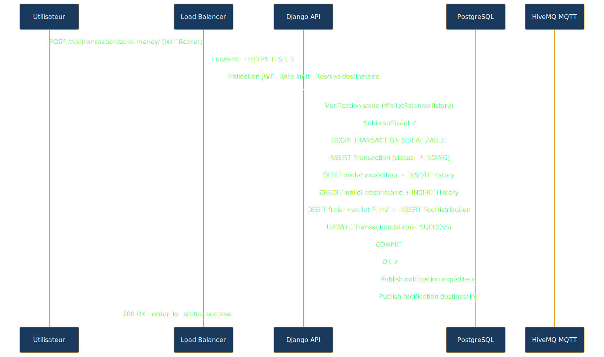

---

# 15.3 Sécurité en Profondeur (Defense in Depth)


---

<!-- _class: divider -->
<!-- _paginate: false -->

# 16
# Conclusion & Engagements BECEAO
## Points forts · Feuille de route · Engagements réglementaires

---

# 16.1 Synthèse des Points Forts

| Domaine | Points forts |
|---------|-------------|
| **Architecture** | Microservices modulaires, Multi-AZ AWS, scalabilité horizontale |
| **Sécurité** | TLS partout, AES-256, JWT rotatif, WAF, Shield Advanced, OWASP |
| **Conformité** | KYC niveaux 1 et 2, LCB-FT, ségrégation des fonds, piste d'audit |
| **Résilience** | HA Multi-AZ, RTO < 4 h, RPO < 1 h, mode dégradé MQTT |
| **Traçabilité** | `WalletBalanceHistory` immuable, CloudTrail 7 ans, logs complets |
| **Interopérabilité** | Wave, Orange Money, MTN, Ecobank, SamirPay — Factory Pattern |
| **Qualité** | CI/CD automatisé, SAST/DAST, Blue/Green, rollback < 5 min |
| **Données** | AES-256, droits utilisateurs implémentés, DPO nommé, RGPD |

---

# 16.2 Feuille de Route de Conformité

| Priorité | Action | Échéance |
|----------|--------|----------|
| P1 | Audit de sécurité externe — Pentest certifié | T + 1 mois |
| P1 | Finalisation KYC niveau 2 (OCR + liveness detection) | T + 2 mois |
| P1 | Déploiement AWS `af-south-1` (Afrique du Sud) | T + 2 mois |
| P1 | Certification PCI-DSS niveau 1 | T + 3 mois |
| P2 | Tableau de bord reporting BECEAO (mensuel/trimestriel) | T + 3 mois |
| P2 | Intégration complète MTN Mobile Money + Ecobank | T + 4 mois |
| P2 | Détection fraude par Machine Learning | T + 6 mois |
| P3 | Certification ISO 27001 | T + 12 mois |

---

# 16.3 Engagements envers la BECEAO

1. **Transparence réglementaire** — Accès en lecture de la BECEAO aux tableaux de bord et rapports de conformité
2. **Reporting périodique** — Soumission des rapports mensuels et trimestriels selon les formats BECEAO
3. **Notification d'incidents** — Information de la BECEAO dans les **24 heures** de tout incident de sécurité significatif
4. **Audits sur demande** — Facilitation totale des audits techniques et de conformité
5. **Ségrégation des fonds** — Maintien strict de la ségrégation fonds clients / fonds propres, réconciliation quotidienne vérifiable
6. **KYC continu** — Amélioration progressive des procédures selon les recommandations BECEAO
7. **Souveraineté des données** — Politique de localisation définie conjointement avec la BECEAO pour les données des résidents UEMOA

---

<!-- _class: cover -->
<!-- _paginate: false -->
<!-- _footer: "" -->

# Direction Technique — PLIIIZ

## technique@plizmoney.com
### core.plizmoney.com

---

*Document confidentiel — Version 2.0 — Mars 2026*
*Réservé à l'usage exclusif de la BECEAO*
*Dossier de demande de Licence Fintech*
*Règlement BECEAO n°15/2002/CM/UEMOA*
